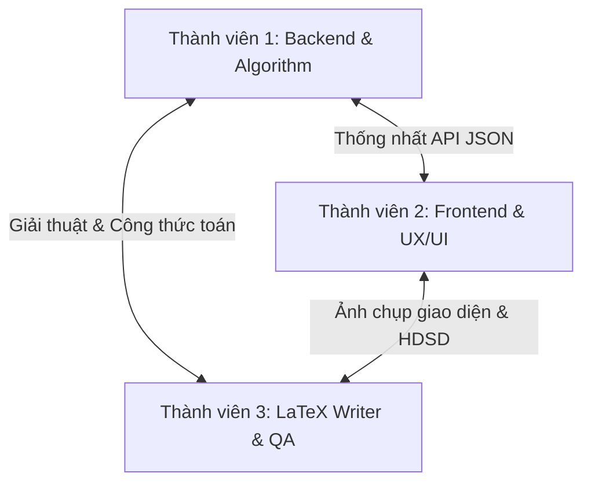

# BẢN PHÂN CHIA CÔNG VIỆC DỰ ÁN QUY HOẠCH TUYẾN TÍNH (LINEAR PROGRAMMING)
> **Mô hình nhóm:** 3 thành viên  
> **Sản phẩm bàn giao:** 1 Ứng dụng Web Full-stack (Next.js + FastAPI) & 1 Báo cáo khoa học viết bằng LaTeX.

---

## 🎯 Tổng Quan Phân Chia Vai Trò (Roles & Responsibilities)

Để tối ưu hóa thế mạnh của từng người và đảm bảo tiến độ dự án trôi chảy, công việc được chia thành 3 vai trò chuyên biệt và bổ trợ lẫn nhau:

1. **Thành viên 1: Chuyên viên Backend & Thuật toán (Backend & Algorithm Developer)**
   - *Trọng tâm:* Toán học chính xác, thuật toán đơn hình, cấu trúc dữ liệu và API hiệu năng cao.
2. **Thành viên 2: Chuyên viên Frontend & UX/UI (Frontend & Interactive Developer)**
   - *Trọng tâm:* Trực quan hóa dữ liệu, form động mượt mà, hiển thị Chain of Thought và đồ thị miền nghiệm.
3. **Thành viên 3: Biên soạn Báo cáo LaTeX & QA Tester (LaTeX Writer, System Designer & QA)**
   - *Trọng tâm:* Viết báo cáo học thuật bằng LaTeX, thiết kế kiến trúc hệ thống, kiểm thử chất lượng (QA/QC) toàn diện và quản lý tiến độ.

---

## 👤 Chi Tiết Nhiệm Vụ Từng Thành Viên

### 1. Thành viên 1: Backend & Algorithm Developer 🐍
*Người chịu trách nhiệm chính về tính chính xác toán học của hệ thống.*

*   **Nhiệm vụ cụ thể:**
    1. **Xây dựng lõi thuật toán đơn hình (`api/solver.py`):**
        - Sử dụng thư viện `fractions.Fraction` trong Python để tính toán mọi giá trị (hệ số, tableau, kết quả) dưới dạng **phân số tối giản**, loại bỏ hoàn toàn sai số dấu phẩy động (float rounding errors).
        - Thực hiện **Phương pháp Đơn hình Tiêu chuẩn (Standard Simplex)**.
        - Thực hiện **Quy tắc Bland (Bland's Rule)** để ngăn chặn vòng lặp vô hạn (cycling) khi xảy ra suy biến.
        - Thực hiện **Phương pháp Đơn hình 2 pha (Two-Phase Simplex)** để giải quyết các ràng buộc phức tạp gồm $\ge$ và $=$.
    2. **Xây dựng API Endpoint (`api/main.py`):**
        - Tạo RESTful API bằng **FastAPI** tiếp nhận bài toán dưới dạng JSON từ Frontend.
        - Xử lý việc trả về chuỗi các bảng đơn hình (Step-by-step Tableaus) cùng giải thích bước xoay (Pivot Element, Entering/Leaving variables) cho tính năng "Chain of Thought".
        - Tích hợp chạy ngầm `scipy.optimize.linprog` để đối chiếu kết quả tự động nhằm đảm bảo thuật toán tự viết không sai sót.
    3. **Viết Bộ Kiểm Thử Tự Động (`api/test_v2.py`):**
        - Viết các test case phủ hết các trường hợp biên: Nghiệm duy nhất, Vô số nghiệm, Vô nghiệm (Infeasible), Không giới hạn (Unbounded), và bài toán lặp vòng (Cycling).
*   **Sản phẩm bàn giao:** Thư mục `/api` chạy ổn định, chính xác 100% về mặt toán học, có tài liệu Swagger API tại `/docs` và các bài test tự động đều pass.

---

### 2. Thành viên 2: Frontend & UX/UI Developer ⚛️
*Người mang lại diện mạo hiện đại, mượt mà và trực quan cho ứng dụng.*

*   **Nhiệm vụ cụ thể:**
    1. **Thiết kế Giao diện Nhập liệu Thông minh (`frontend/app/page.tsx` & `/components`):**
        - Sử dụng **Next.js (TypeScript) + Tailwind CSS** tạo UI/UX cao cấp (sleek dark mode, glassmorphism, responsive).
        - Thiết kế **Dynamic Form:** Cho phép người dùng tăng/giảm số lượng biến ($n$) và số lượng ràng buộc ($m$) bằng nút bấm bấm trực quan; các ô nhập ma trận tự động sinh ra tương ứng.
        - Tạo tính năng **"Load Example":** Cho sẵn 3-4 nút bấm bài toán mẫu (Ví dụ: Bài 2 biến vẽ được hình, bài vô số nghiệm, bài bị lặp vòng cần luật Bland). Click vào là tự điền ma trận để test nhanh.
    2. **Hiển thị "Chain of Thought" (Từng bước giải đơn hình):**
        - Thiết kế hiển thị các bảng Simplex Tableau dưới dạng phân số tối giản (ví dụ $1/3$, $-5/2$) rõ ràng.
        - Tô màu nổi bật (Highlight) cột xoay (Pivot Column), hàng xoay (Pivot Row) và phần tử xoay (Pivot Element) ở mỗi bước.
        - Hiển thị giải thích ngắn gọn lý do chọn xoay ở từng bước.
    3. **Trực quan hóa miền nghiệm 2D (2D Feasible Region Graph):**
        - Khi bài toán chỉ có **đúng 2 biến quyết định**, sử dụng **Chart.js** hoặc **Plotly.js** để vẽ đồ thị:
            - Vẽ các đường thẳng ràng buộc.
            - Tô màu miền nghiệm khả thi (Feasible Region).
            - Đánh dấu điểm tối ưu (Optimal Point) bằng một icon bắt mắt.
*   **Sản phẩm bàn giao:** Thư mục `/frontend` hoạt động mượt mà, giao diện đẹp đẽ làm người dùng ấn tượng ngay từ cái nhìn đầu tiên, kết nối API Backend trơn tru.

---

### 3. Thành viên 3: LaTeX Writer, System Designer & QA Tester 📝
*Người đảm bảo dự án có chất lượng xuất sắc ở cả góc độ học thuật và thực tiễn.*

*   **Nhiệm vụ cụ thể:**
    1. **Thiết lập và Biên soạn Báo cáo LaTeX (Overleaf):**
        - Tổ chức cấu trúc tài liệu khoa học chuẩn mực trên Overleaf.
        - Viết chương **Cơ sở lý thuyết**: Định nghĩa Quy hoạch tuyến tính, dạng chuẩn, giải thuật đơn hình, cơ chế chống lặp vòng của Luật Bland, kỹ thuật của Đơn hình 2 pha.
        - Cùng Thành viên 1 viết phần **Thiết kế Thuật toán**: Mô tả thuật toán dưới dạng mã giả (Pseudocode) và lưu đồ (Flowchart).
    2. **Thiết kế Kiến trúc Hệ thống (System Architecture Design):**
        - Vẽ sơ đồ kiến trúc tương tác giữa Client (Frontend Next.js) và Server (FastAPI Backend).
        - Vẽ sơ đồ luồng dữ liệu (Dataflow Diagram) từ lúc nhập liệu -> API -> Bộ giải Simplex -> Trả dữ liệu bước giải -> Render giao diện.
    3. **Đảm bảo Chất lượng & Kiểm thử thực tế (QA/QC):**
        - Kiểm thử hộp đen (Black-box Testing): Đóng vai người dùng nhập các biểu thức sai, nhập chữ vào ô số để kiểm tra khả năng bắt lỗi (Validation) của Frontend.
        - Kiểm thử tích hợp (Integration Testing): Chạy thử các bài toán phức tạp trên cả web để đối chiếu xem kết quả từ API hiển thị lên UI có khớp và đẹp mắt không.
        - Thu thập dữ liệu thực nghiệm: Chạy thử ít nhất 5 bài toán khác nhau, chụp ảnh màn hình các bước giải và đồ thị để đưa vào chương **Kết quả thực nghiệm** của báo cáo LaTeX.
    4. **Hoàn thiện Tài liệu dự án (`README.md`, `Huong_dan_chay.md`):**
        - Viết hướng dẫn sử dụng và hướng dẫn cài đặt chi tiết cho người chấm điểm.
*   **Sản phẩm bàn giao:** File báo cáo LaTeX biên dịch hoàn hảo không lỗi, xuất ra PDF báo cáo chỉn chu và một bảng dữ liệu kiểm thử hệ thống đầy đủ.

---

## 📅 Lộ Trình Phối Hợp & Các Điểm Cột Mốc (Milestones)

Dự án nên được triển khai qua **4 pha phối hợp** sau để đảm bảo không ai bị nghẽn (bottleneck) tiến độ:

### Pha 1: Thống nhất & Thiết kế (Ngày 1 - 2)
*   **Họp nhóm:** Thống nhất định dạng JSON API.
*   **Thành viên 3:** Tạo project LaTeX, viết sẵn khung báo cáo, định dạng các package toán học cần dùng.
*   **Thành viên 1 & 2:** Tạo khung dự án rỗng, chạy thử xem Frontend đã gọi được API cơ bản ("Hello World") của Backend chưa.

### Pha 2: Phát triển Cốt lõi (Ngày 3 - 8)
*   **Thành viên 1:** Tập trung code `api/solver.py`, hoàn thiện các thuật toán Standard, Bland's Rule, Two-Phase. Chạy thử nghiệm bằng script test.
*   **Thành viên 2:** Thiết kế form động nhập ma trận hệ số, xử lý state điền ma trận. Cấu hình thư viện vẽ đồ thị 2D.
*   **Thành viên 3:** Viết chương lý thuyết toán học trong LaTeX. Vẽ sơ đồ kiến trúc hệ thống và luồng dữ liệu.

### Pha 3: Tích hợp & Kiểm thử (Ngày 9 - 11)
*   **Thành viên 1 + 2:** Kết nối Frontend vào Backend. Truyền dữ liệu ma trận từ form Next.js sang API và lấy chuỗi Tableaus cùng kết quả về để hiển thị trực quan lên giao diện web.
*   **Thành viên 3:** Thực hiện kiểm thử toàn diện các trường hợp lỗi, tạo bảng so sánh kết quả tự viết với `scipy` (do Thành viên 1 cung cấp).

### Pha 4: Hoàn thiện & Bàn giao (Ngày 12 - 14)
*   **Thành viên 2:** Tinh chỉnh CSS, làm mịn hiệu ứng hover, căn lề và cải thiện tốc độ load đồ thị.
*   **Thành viên 3:** Chụp ảnh màn hình web đưa vào báo cáo LaTeX, rà soát lỗi chính tả toán học, xuất báo cáo PDF.
*   **Cả nhóm:** Deploy ứng dụng lên Vercel theo hướng dẫn cấu hình ở file [vercel.json](file:///c:/Users/ADMIN/Downloads/Linear%20Programming/vercel.json).

---

## 🛠️ Ma Trận Phối Hợp Chéo (Collaboration Matrix)

| Đầu ra cần bàn giao | Người thực hiện chính | Người hỗ trợ | Cách thức phối hợp |
| :--- | :--- | :--- | :--- |
| **API Endpoints & Schema** | Thành viên 1 | Thành viên 2 | Thống nhất cấu trúc dữ liệu JSON để frontend hiển thị được đầy đủ tableau và đồ thị. |
| **Đồ thị Miền nghiệm 2D** | Thành viên 2 | Thành viên 1 | Thành viên 1 cung cấp danh sách tọa độ các đỉnh của miền nghiệm đa diện (hoặc phương trình đường thẳng) từ backend nếu cần thiết. |
| **Mã giả & Lưu đồ thuật toán** | Thành viên 3 | Thành viên 1 | Thành viên 1 viết mã nguồn, giải thích logic, Thành viên 3 chuyển thể thành mã giả LaTeX (`algorithm2e`) và vẽ flowchart. |
| **Ảnh minh họa thực nghiệm** | Thành viên 3 | Thành viên 2 | Thành viên 2 tối ưu giao diện trực quan nhất để Thành viên 3 chụp ảnh đưa vào chương kết quả thực nghiệm. |
| **Deploy hệ thống lên Vercel** | Thành viên 1 & 2 | Thành viên 3 | Cả 3 người cùng phối hợp kiểm tra ứng dụng chạy thực tế trên cloud để đảm bảo trùng khớp với báo cáo. |

---
> 💡 **Lời khuyên thành công:** Hãy sử dụng Git để quản lý mã nguồn (tạo các nhánh riêng `feature/backend` và `feature/frontend` sau đó gộp vào `main`). Sử dụng Overleaf để Thành viên 3 viết báo cáo và các thành viên còn lại có thể vào review/sửa công thức trực tiếp nếu cần!
